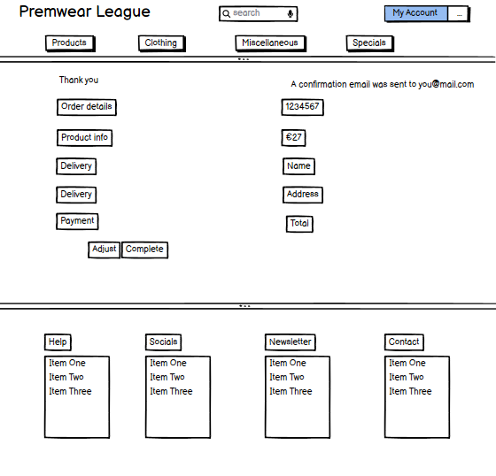
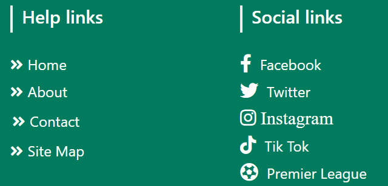

# Premwear League Website- PP5

Welcome to our premier destination for all your football gear needs, inspired by the electrifying spirit of the English Premier League. Discover a vast array of authentic football gear, meticulously curated to satisfy the cravings of die-hard fans and aspiring athletes alike. Enjoy a seamless shopping experience with our intuitive website design.

Developed by Paul Hughes

[Live link to website](https://premwear-league-b168782f243c.herokuapp.com/)

## UX

In designing this website, simplicity was a key focus. Complicating the layout of an e-commerce platform can detract from the user experience, which is something I actively sought to avoid.

Throughout the site, I've maintained a straightforward design approach. Users can conveniently track their basket's total as they browse and add items. Unlike platforms that conceal this information until checkout, my approach fosters trust and helps users manage their spending effectively.

Navigation is intuitive, facilitated by a user-friendly main menu that allows easy exploration of all sportswear product categories. This site is crafted to offer seamless access to a wide range of products without overwhelming users with complex menus or structures.

In essence, the website prioritizes simplicity and transparency, aiming to provide users with a positive and stress-free browsing experience from start to finish.

# Table of Contents

1. [Project Goals](#project-goals)
    - [Purpose](#purpose)
    - [Site Goals](#site-goals)
    - [User Goals](#user-goals)
2. [User Stories](#user-stories)
3. [Wireframes](#wireframes)
    - [Desktop wireframes](#desktop-wireframes)
    - [Mobile wireframes](#mobile-wireframes)
4. [Layout and Styling](#layout-and-styling)
    - [Bootstrap](#bootstrap)
5. [Media queries](#media-queries)
6. [Imagery](#imagery)
7. [Colour Scheme](#colour-scheme)
8. [Typography](#typography)
9. [Icons](#icons)
10. [Favicon](#favicon)
11. [Imagery](#imagery)

## Project Goals

### Purpose

An e-commerce site selling Premier League football shirts, hats, shorts, socks and flags, which allows customers to browse and buy, while allowing site admins to add, edit and delete products.

### Site Goals

- Product Showcase: Showcase the latest trends, designs, and innovations in the sportswear industry, highlighting the quality and functionality of the products offered.
- Brand Promotion: Serve as a platform to promote and build brand awareness for the sportswear brand, leveraging digital marketing strategies and engaging content to attract and retain customers.
- Personalization: Utilize data analytics and customer insights to personalize the shopping experience, recommending products based on past purchases, preferences, and browsing behavior.
- Mobile Compatibility: Ensure the website is mobile-responsive, catering to the growing number of customers who prefer to shop on their smartphones and tablets.
- Customer Support: Provide efficient customer support channels, including messaging and email to address inquiries, resolve issues, and ensure customer satisfaction post-purchase.

[Back to Table of Contents](#table-of-contents)

### User Goals

- Customer Convenience: Provide customers with a convenient platform to browse, select, and purchase sportswear products from the comfort of their homes or on the go, enhancing overall shopping experience.
- Find Desired Products Easily: Users aim to quickly locate the sportswear products they are interested in, whether it's specific items, brands, or categories.
- View Product Details: Users seek detailed information about each product, including descriptions, materials, sizing charts, and customer reviews, to make informed purchasing decisions.
- Secure Transactions: Users prioritize secure payment methods and data protection measures to safeguard their personal and financial information during online transactions.
- Satisfactory Customer Service: Users expect responsive customer support services to address inquiries, resolve issues, and provide assistance throughout the shopping experience, ensuring a positive overall interaction with the website.

[Back to Table of Contents](#table-of-contents)

## User Stories

To help with the development of this project, I created user stories to map out tasks I needed to achieve in order to build the website to a good standard. I further split these user stories into epics in order to take an agile approach to its development.

View a full list of user stories [here](https://github.com/users/hughes84/projects/3).

View the Sprints here [here](https://github.com/hughes84/Premwear-league/milestones).

[Back to Table of Contents](#table-of-contents)

## Wireframes

To help with the design of the site, I created wireframes for each page. To follow best practice, wireframes were developed for mobile and desktop sizes.
I've used [Balsamiq](https://balsamiq.com/wireframes) to design my site wireframes.

## Desktop wireframes

Click to Desktop wireframes

 
 
 
 

[Back to Table of Contents](#table-of-contents)

## Mobile wireframes

Click to Mobile wireframes

 
 
 
 

[Back to Table of Contents](#table-of-contents)

Based on prior experience I decided that desktop and mobile wireframes would be sufficient to keep the overall layout of the site on track, the expectation being that [Bootstrap's grid system](https://getbootstrap.com/docs/5.3/layout/grid/) would provide the responsiveness required at different device breakpoints in between (see [Layout and Styling](#layout-and-styling) section below).

Furthermore, I focused the wireframes on the main product purchase workflow, recognising that this was where design choices would be key. The other pages contain simple forms and tables, so I considered there to be little value in producing specific wireframes for those pages.

### Layout and Styling

#### Bootstrap

The site uses the [Bootstrap 5.3 Grid system](https://getbootstrap.com/docs/5.3/layout/grid/) to ensure it is fully responsive on all device and viewport sizes. Bootstrap 5.3 uses the following [breakpoints](https://getbootstrap.com/docs/5.3/layout/breakpoints/), the shorthand references for which are used throughout the rest of this document:

| Breakpoint        | Shorthand   | Dimensions |
|-------------------|-------------|------------|
| Extra small       | xs          | <576px     |
| Small             | sm          | ≥576px     |
| Medium            | md          | ≥768px     |
| Large             | lg          | ≥992px     |
| Extra large       | xl          | ≥1200px    |
| Extra extra large | xxl         | ≥1400px    |

[Back to Table of Contents](#table-of-contents)

In addition, the site uses the following specific components from the Bootstrap library:

- [Navbar](https://getbootstrap.com/docs/5.3/components/navbar/) for the header.
- [Cards](https://getbootstrap.com/docs/5.3/components/card/) to display product information on the products page.
- [Accordion](https://getbootstrap.com/docs/5.3/components/accordion/) to provide a collapsible menu for the FAQs.
- [Alerts](https://getbootstrap.com/docs/5.3/components/alerts/) to display status messages.
- [Modal plugin](https://getbootstrap.com/docs/5.3/components/modal/) to display enlarged product images on click.
- [Spacing](https://getbootstrap.com/docs/5.3/utilities/spacing/) and [typography](https://getbootstrap.com/docs/5.3/content/typography/) utility classes throughout, ensuring the layout and font are appropriate to the device in use.
- [Color](https://getbootstrap.com/docs/5.3/utilities/colors/) utility classes to provide specific meaning to text throughout.
- [Display property](https://getbootstrap.com/docs/5.3/utilities/display/) to toggle the visibility of some components at certain breakpoints.

[Back to Table of Contents](#table-of-contents)

#### Media queries

In addition to the responsive layout provided by Bootstrap, specific media queries are used to rotate the main background image to match the orientation of the device, and to change the sizes of the modal on the home page.

### Imagery

- The **Background image** of footballer's from the English Premier League is depicted of a virtual video game from[PESnewupdate](file:///C:/Users/Owner/pp5/links/PES%202021%20Premier%20League%20Kitpack%202023_2024%20~%20PESNewupdate.com%20_%20Free%20Download%20Latest%20Pro%20Evolution%20Soccer%20Patch%20&%20Updates.html). 
In the image, the group of footballers from various English Premier League teams stands shoulder to shoulder, proudly showcasing their respective team jerseys. The players are arranged in lines, with each athlete donning the iconic colors and designs of their club's uniform. The jerseys are vibrant and meticulously detailed, featuring the distinct logos, crests, and sponsorships associated with each Premier League team.

Background image

  
  
   
  

  [Back to Table of Contents](#table-of-contents)

- The **product images** were taken from various different websites as to capture such a range of a selection. Those websites being; [jdsports](https://www.jdsports.co.uk/sport/football/league/premier-league/), [sportsdirect](https://ie.sportsdirect.com/), [kitbag](https://www.kitbag.com/en/premier-league/football-kits-socks/o-32750439+d-6761548326-128651+z-9-1112756498), [flagladyusa](https://flagladyusa.com/collections/premier-league-flags).

### Colour Scheme

- The **main colours** used for site components (such as navigation items and buttons) are black (#555) and white rgb(255, 255, 255). Using black and white for the navigation on my website I feel it creates a sleek and minimalist design aesthetic while ensuring clear and easy navigation for users. At the top of the website, the white navigation bar spans the width of the page. The navigation links are displayed in bold black text, providing a high contrast that makes them easily visible against the white background.

- The update and remove buttons in the shopping bag are bright and colourful displaying their significance. I chose red (#dc3545) as it displays attention-grabbing, associated with urgency, importance, and alertness. In some contexts, red is used to signal caution, warning, or error. I used green (#28a745) as it is often associated with go, proceed, or confirmation.

- The shopping bag when stocked displays a blue (#17a2b8). I used this brighter color to show the user they have added to their bag which is accompanied by a message. 

- I chose a green (#007b5e) footer from Bootstrap which I feel compliments the color schemes throughout the website. 

[Back to Table of Contents](#table-of-contents)

### Typography

- The site uses [Lato](https://fonts.google.com/specimen/Lato) throughout, imported from [Google Fonts](https://fonts.google.com/). Lato is a popular sans-serif typeface that is widely used in various design contexts, including print and digital media. Lato is known for its modern and elegant appearance, making it suitable for a wide range of design applications.

### Icons

- [Bootstrap Icons](https://icons.getbootstrap.com/) have been used for **navigation items**, **alerts** and various **buttons** throughout the site.

Navigation icons

  
  
  
  

  

  

Alerts

  
  
  
  
  

  

  

Button

  
  

  

  [Back to Table of Contents](#table-of-contents)

  ### Favicon

- The **favicon** is the football representing the sites theme, generated using [Favicon Generator](https://favicon.io/favicon-generator/).

  

Favicon

  

  

  ### Loading spinner

- The site utilises a **loading spinner** on the checkout page to illustrate that a page is loading.

  

Loading Spinner

  

  

