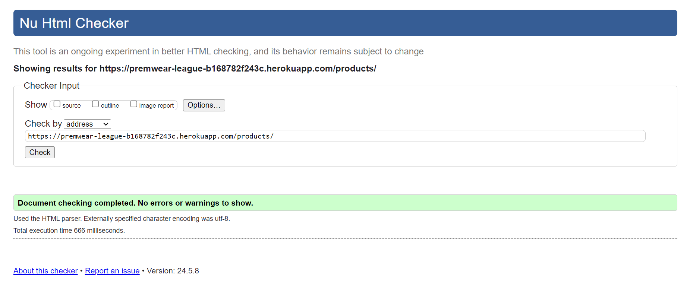

# Testing

Return back to the [README.md](README.md) file.

Throughout the development of this project, I've carried out numerous tests to ensure that the site works well. In this section you will find documentation of all tests carried out throughout the site.

## Code Validation

I have validated all of my code using the recommended tools for each language.

### HTML

I have used the recommended [HTML W3C Validator](https://validator.w3.org) to validate all of my HTML files.

| Page | Screenshot | Notes |
| --- | --- | --- | --- |
| Home |  | Pass: No Errors |
| All Products |  | Pass: No Errors |
| Single Product |  | Pass: No Errors |
| Contact |  | Pass: No Errors |
| Sign Up |  | Pass: No Errors |
| Sign In |  | Pass: No Errors |
| Password Reset |  | Pass: No Errors |
| Shopping Bag |  | Pass: No Errors |
| Checkout |  | Pass: No Errors |
| Sitemap.html |  | Pass: No Errors |
| About page |  | Pass: No Errors |

