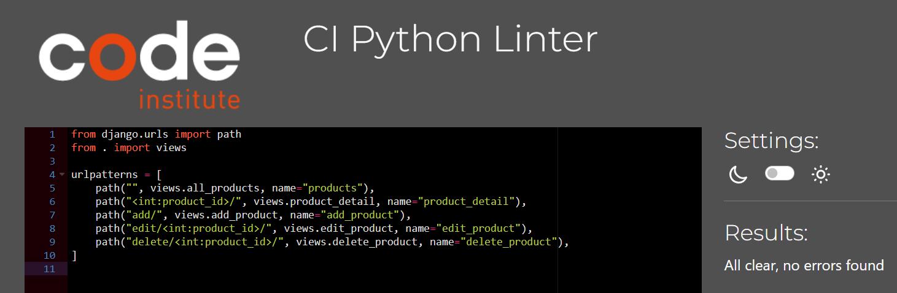
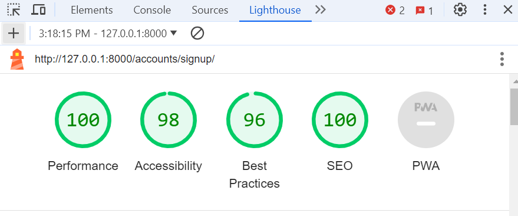
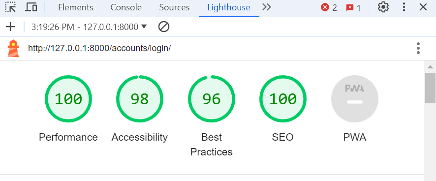

# Testing

Return back to the [README.md](README.md) file.

Throughout the development of this project, I've carried out numerous tests to ensure that the site works well. In this section you will find documentation of all tests carried out throughout the site.

## Code Validation

I have validated all of my code using the recommended tools for each language.

### HTML

I have used the recommended [HTML W3C Validator](https://validator.w3.org) to validate all of my HTML files.

| Page | Screenshot | Notes |
| --- | --- | --- |
| Home |  | Pass: No Errors |
| All Products |  | Pass: No Errors |
| Single Product |  | Pass: No Errors |
| Contact |  | Pass: No Errors |
| Sign Up |  | Pass: No Errors |
| Sign In |  | Pass: No Errors |
| Password Reset |  | Pass: No Errors |
| Shopping Bag |  | Pass: No Errors |
| Checkout |  | Pass: No Errors |
| Sitemap.html |  | Pass: No Errors |
| About page |  | Pass: No Errors |

### CSS

I have used the recommended [CSS Jigsaw Validator](https://jigsaw.w3.org/css-validator) to validate all of my CSS files.

| File | Screenshot | Notes |
| --- | --- | --- |
| base.css |  | Pass: No Errors |
| home.css |  | Pass: No Errors |

### JavaScript

I have used the recommended [JShint Validator](https://jshint.com) to validate all of my JS files.

| File | Screenshot | Notes |
| --- | --- | --- |
| stripe.js |  | Pass: No Errors |
| home.js |  | Pass: No Errors |

### Python

I have used the recommended [Black](https://pypi.org/project/black/) to validate all of my Python files.

| File | Screenshot | Notes |
| --- | --- | --- |
| about/views.py |  | Pass: No Errors |
| about/urls.py |  | Pass: No Errors |
| about/models.py |  | Pass: No Errors |
| bag/contexts.py |  | Pass: No Errors |
| bag/urls.py |  | Pass: No Errors |
| bag/views.py |  | Pass: No Errors |
| checkout/urls.py |  | Pass: No Errors |
| checkout/views.py |  | Pass: No Errors |
| checkout/models.py |  | Pass: No Errors |
| checkout/forms.py |  | Pass: No Errors |
| checkout/webhooks.py |  | Pass: No Errors |
| checkout/webhook_handler.py |  | Pass: No Errors |
| contact/form.py |  | Pass: No Errors |
| contact/models.py |  | Pass: No Errors |
| contact/views.py |  | Pass: No Errors |
| home/urls.py |  | Pass: No Errors |
| home/views.py |  | Pass: No Errors |
| newsletter/models.py |  | Pass: No Errors |
| newsletter/forms.py |  | Pass: No Errors |
| newsletter/views.py |  | Pass: No Errors |
| premwear_league/views.py |  | Pass: No Errors |
| premwear_league/urls.py |  | Pass: No Errors |
| premwear_league/sitemaps.py |  | Pass: No Errors |
| products/models.py |  | Pass: No Errors |
| products/forms.py |  | Pass: No Errors |
| products/urls.py |  | Pass: No Errors |
| products/views.py |  | Pass: No Errors |
| profiles/forms.py |  | Pass: No Errors |
| profiles/models.py |  | Pass: No Errors |
| profiles/urls.py |  | Pass: No Errors |
| profiles/views.py |  | Pass: No Errors |
| sitemap/views.py |  | Pass: No Errors |
| sitemap/urls.py |  | Pass: No Errors |

## Browser Compatibility

I've tested my deployed project on multiple browsers to check for compatibility issues.

| Browser | Screenshot | Notes |
| --- | --- | --- |
| Chrome |  | Works as expected |
| Firefox |  | Works as expected |
| Edge |  | Works as expected |

## Responsiveness

I've tested my deployed project on multiple devices to check for responsiveness and found no issues here is an example

| mobile | ipad | laptop|
| --- | --- | --- | 
|  |  |  |

## Defensive Programming

Defensive programming was manually tested with the below user acceptance testing:

| Page | User Action | Expected Result | Pass/Fail | Comments |
| --- | --- | --- | --- | --- |
| **Home Page** | | | | |
| | Click on Logo | Redirection to Home page | Pass | |
| | Click on Shop Now button | Redirection to Products page | Pass | |
| **All Products Page** | | | | |
| | Click on Products link in navbar | Redirection to Products page | Pass | |
| | Click on Products category link in navbar | Redirection to product page | Pass | Products filtered by clicked category |
| | Click on Product card image | Redirection to Product Detail page for that product | Pass | |
| | Click on Add to basket button | Product added to basket | Pass | Product added to cart and cart modal shown |
| **Product Detail Page** | | | | |
| | Click on Product image in products page | Redirection to Product Detail page | Pass | |
| | Click on Keep Shopping button | Redirection to Products page | Pass | |
| | Click Add To Basket button | Product is added to basket and quantity is set to the user's choice | Pass | |
| **Search** | | | | |
| | Enter letter into search bar | All products linked returned | Pass | Products filtered to only show products containing search term |
| **Contact Page** | | | | |
| | Click on Contact link in footer | Redirection to Contact Us page | Pass | |
| | Enter name | Form will only submit if all fields are filled | Pass | |
| | Enter valid email address | Field will only accept email address format | Pass | |
| | Enter message | Form will only submit if all fields are filled | Pass | |
| | Click Send with missing fields | Message lets user know all fields are required | Pass | |
| **Sign Up Page** | | | | |
| | Click on Register button under account on nav menu | Redirection to Sign Up page | Pass | |
| | Enter valid email address | Field will only accept email address format | Pass | |
| | Enter valid password (twice) | Field will only accept password format | Pass | |
| | Click Sign Up button on sign up page | Sends confirmation email and lets user know to check their email | Pass | |
| | Click link in confirmation email | Redirects user to sign in page | Pass | |
| **Sign In Page** | | | | |
| | Click on the Login button under account on nav menu | Redirection to Login page | Pass | |
| | Enter valid email address | Field will only accept email address format | Pass | |
| | Enter valid password | Field will only accept password format | Pass | |
| | Click Login button on login page | Redirects user to homepage | Pass | |
| | Click Forgot Password | Redirects user to password reset page | Pass | |
| | Sign in before confirming account | Redirects to message reminding user to confirm email address | Pass | |
| **Password Reset Page** | | | | |
| | Enter valid email address | Field will only accept email address format | Pass | |
| | Click Reset Password button | Sends email with instructions to reset password | Pass | |
| **Log Out Page** | | | | |
| | Click Logout button | Redirects user to logout page | Pass | Confirms logout first |
| | Click Confirm Logout button | Redirects user to home page | Pass | |
| **Profile Page** | | | | |
| | Click on the My Profile link under account on nav menu | Redirection to profile page page | Pass | Only shows for logged in users |
| | Click Update Information button | Saves form contents to be default information for user | Pass | |
| **Cart** | | | | |
| | Click Bag icon in main nav | Redirects user to shopping bag page | Pass | Shows back to shop button if basket is empty |
| | Click update button under quantity selector form | Updated quantity of product in basket to number in quantity select form | Pass | |
| | Click remove button | Removes product from basket completely | Pass | |
| | Click on Keep Shopping button | Redirection to Products page | Pass | |
| | Click on Secure Checkout button | Redirection to checkout page | Pass | |
| **Checkout** | | | | |
| | Click on Secure Checkout button in basket | Redirection to checkout page | Pass | |
| | Click Complete Order button without all required fields filled out | Message letting user know that required fields need to be filled out | Pass | |
| | Click on Create an account link | Redirection to sign up page | Pass | Only visible to logged out users |
| | Click on login link | Redirection to sign in page | Pass | Only visible to logged out users |
| | Click Complete Order button without card details filled out | Message letting user know that their card number is incomplete | Pass | |
| | Click Complete Order button with all details filled out | Loading spinner appears and order is processed | Pass | |
| | Order completed | Order confirmation email is sent to the user and redirection to checkout success page | Pass | |
| **Checkout Success Page** | | | | |
| | Order completed | Redirection to checkout success page | Pass | |
| **Footer** | | | | |
| | Click on Subscribe button on filled newsletter form | Alert message lets user know they have signed up for the mailing list and welcome email is sent to address provided | Pass | |

## User Story and Feature Testing
All the user stories were tested manually, that including all the representative features, and were described bellow with a summary of the steps made for demonstrating the validation of the tests:  

### Epics:

**User Story #2:** 
As a **visitor** I want to be able to establish what products are available on the site.

| **Feature** | **Action** | **Expected Result** | **Actual Result** |
|-------------|------------|---------------------|-------------------|
| Click selection on Nav Bar | Browse selected category  | Products displayed | Works as expected |
  

**User Story #3:** 
As a **visitor** I want to browse products using easy-to-follow navigation

| **Feature** | **Action** | **Expected Result** | **Actual Result** |
|-------------|------------|---------------------|-------------------|
| Click All products | Choose selected navigation | Products displayed | Works as expected |
  

**User Story #4:** 
As a **visitor** I want to be able to purchase selected products.

| **Feature** | **Action** | **Expected Result** | **Actual Result** |
|-------------|------------|---------------------|-------------------|
| Choose selected products/s | Click Go to secure checkout | Enter personal details and complete order button | Works as expected |

  

**User Story #5:** 
As a **visitor** , I want to be able to create a new account so that I can save my order details and favorite products .

| **Feature** | **Action** | **Expected Result** | **Actual Result** |
|-------------|------------|---------------------|-------------------|
| Click My Account then click Register | Enter personal details as requested | Verify email adress and sign in | Works as expected |
  

**User Story #6:** 
As a **User** , I want to be able to update my profile information, including shipping address and contact details.

| **Feature** | **Action** | **Expected Result** | **Actual Result** |
|-------------|------------|---------------------|-------------------|
| Log in | On My Account click on My Profile | Update information as desired | Works as expected | 
  

**User Story #7:** 
As a **user** , I want to be able to log in and log out of my account and change my password or email address.

| **Feature** | **Action** | **Expected Result** | **Actual Result** |
|-------------|------------|---------------------|-------------------|
| On my Account click login | On login page enter username and email  | User is logged in | Works as expected |
| When logged in, on my Account click logout | On sign out psge click sign out button  | User signed out | Works as expected |
  

**User Story #8:** 
As a **user** , I want to view details of my previous orders.

| **Feature** | **Action** | **Expected Result** | **Actual Result** |
|-------------|------------|---------------------|-------------------|
| Login and go to My Profile | Previous orders are displayed here | Previous orders are displayed here | Works as expected |
  

**User Story #9:** 
As a **staff user**, I want to add products to the inventory.

| **Feature** | **Action** | **Expected Result** | **Actual Result** |
|-------------|------------|---------------------|-------------------|
| Login and if a staff user click My Profile and Product Management | Add product details and select image | New product is added | Works as expected |
  

**User Story #10:** 
As a **staff user**, I want to edit or delete existing products in the inventory.

| **Feature** | **Action** | **Expected Result** | **Actual Result** |
|-------------|------------|---------------------|-------------------|
| Go to admin section in backend and click products| Select chosen product and edit or delete | Product is edited or deleted | Works as expected |
  

**User Story #12:** 
As a **superuser** , I want to receive details of customer orders to be fulfilled.

| **Feature** | **Action** | **Expected Result** | **Actual Result** |
|-------------|------------|---------------------|-------------------|
| Go to admin section in backend and click orders | Superuser can see orders here with order number, date and time | Orders displayed | Works as expected |
  

**User Story #13:** 
As a **superuser** , I want to add or edit product categories.

| **Feature** | **Action** | **Expected Result** | **Actual Result** | 
|-------------|------------|---------------------|-------------------|
| Go to admin section in backend and click categories | Chose selected category and edit or delete | Category chosen edited/deleted | Works as expected |
  

**User Story #14:** 
As a **superuser** , I want to add or remove admins/users.

| **Feature** | **Action** | **Expected Result** | **Actual Result** |
|-------------|------------|---------------------|-------------------|
| Go to admin section in backend and click users | Select admin/user to add or remove and update status or delete | Admins/User added/removed | Works as expected |
  

**User Story #15:** 
As a **visitor** I want to be able to message the admin through a contact form.

| **Feature** | **Action** | **Expected Result** | **Actual Result** |
|-------------|------------|---------------------|-------------------|
| Click contact link in footer | Fill out contact form and submit | User receives success message and superuser receives email | Works as expected |
  

**User Story #16:** 
As a **visitor** I want to be able to sign up for a newsletter. 

| **Feature** | **Action** | **Expected Result** | **Actual Result** |
|-------------|------------|---------------------|-------------------|
| Enter email address in Newsletter box in footer and hit subscribe | User receives success message and success email | Success message and email message received | Works as expected |
  

**User Story #17:** 
As a **user**, I want to be able to create and manage a wish list in my profile, so that I can save products I'm interested in for future reference or purchase. 

| **Feature** | **Action** | **Expected Result** | **Actual Result** |
|-------------|------------|---------------------|-------------------|
| When logged in, on any selected product click on heart to add to wishlist | In My Profile, view, edit, delete wishlist | Wishlist displayed, can be edited or deleted | Works as expected |
  

**User Story #18:** 
As a site **admin** i want a sitemap.xml so search engines understand the structure of the website and index its content more efficiently.

| **Feature** | **Action** | **Expected Result** | **Actual Result** |
|-------------|------------|---------------------|-------------------|
| In footer click Sitemap link | View of SEO | Redirected to SEO page | Works as expected |
  

**User Story #19:** 
As a site admin I want to be able to share the business on social media so that I can reach and market to a larger audience.

| **Feature** | **Action** | **Expected Result** | **Actual Result** |
|-------------|------------|---------------------|-------------------|
| On footer click on Facebook link | User is redirected to sites Facebook page | Sites Facebook page | Works as expected |
  

## Lighthouse Audit

I've tested my deployed project using the Lighthouse Audit tool to check for any major issues.

| Page | Screenshot | Notes |
| --- | --- | --- |
| Home |  | No major warnings |
| Products |  | Some minor warnings |
| Product Details |  | No major warnings |
| Contact |  | No major warnings |
| Bag |  | No major warnings |
| Checkout |  | No major warnings |
| Profile |  | No major warnings |
| Sitemap |  | No major warnings |
| Sign Up |  | No major warnings |
| Sign In |  | No major warnings |
| Sign Out |  | No major warnings |

## Bugs

**Fixed Bugs**

| Bug | Expected behavior | Fix | Status |
| --- | --- | --- | --- |
| When processing the payment using secure checkout, Django error "AttributeError at /checkout/ 'NoneType' object has no attribute 'split'" displayed | The secure payment should complete, the order summary be displayed and a success toast message with the order number appear | Typo in checkout/webhook_handler.py | Closed |
| When deleting the product quantity value in the input field and clicking the ADD TO SHOPPING BAG button causes an error | Be a positive integer between 1 & 99 | Added required attribute to the quantity input tag | Closed |
| When selecting the sorting options by Name (A-Z) or Name (Z-A) a Django error occurs | The products should be sorted by name in ascending or descending order based on the user selection | Found a typo in Products view.py | Closed |
| When logging in to site, success message appears with shopping bag joined | Success message appear by itself | Changed conditional logic in  tag so code will execute if all three sub-conditions are True simultaneously | Closed |
| When in shopping bag and try to logout of account, dropdown buttons on My Account not working and cursor appearing | Pointer to appear and My Profile and logout buttons work | Removed async in script tags in base.html | Closed |

## Unfixed Bugs

There are no known bugs unfixed 